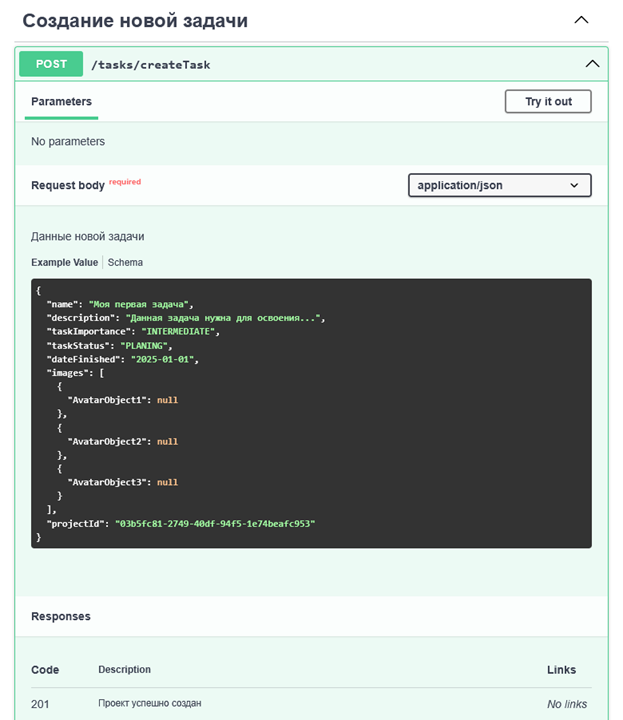

# TaskManager
Приложение для создания и отслеживания своих задач, имея чат для обсуждения, клиентскую и серверную часть

## Архитектура

## Используемые технологии

## Фичи приложения
* В качестве безопасности используются JWT токены
* Возможность авторизации по протоколу OAuth2
* Микросервисная архитектура
* Реализован групповой чат между пользователями с помощью простолока WebSocket и STOMP

## Старт
### Старт подразумевает, что на компьютере уже установлен PostgreSQL и NodeJS!
* Клонировать репозиторий `git clone git@github.com:Yuranium/TaskManager.git`
* Открыть через IDE
* Скачать необходимые сервисы с помощью команды `docker-compose up --build`
* Установить все необходимые для каждого сервиса переменные окружения
* Настроить схему БД (схема к каждому сервису есть в директории resources)
* Запустить клиентскую часть, перейдя в директорию **react_application** и 
ввести команду `npm start`
* Запустить все бэкенд сервисы на Java Spring Boot
* Перейти на **localhost:3000**

## Демо
1) Главная страница  
   
2) Страница логина  
   
3) Страница регистрации  
   
4) Страница профиля пользователя  
   
5) Страница группового веб-чата  
   
6) Страница проектов  
   
7) Страница задач  
   
8) Кастомное модальное окно  
   
9) Инфографика по задачам и проектам  
   
10) Документация эндпоинтов через openAPI  
      
    